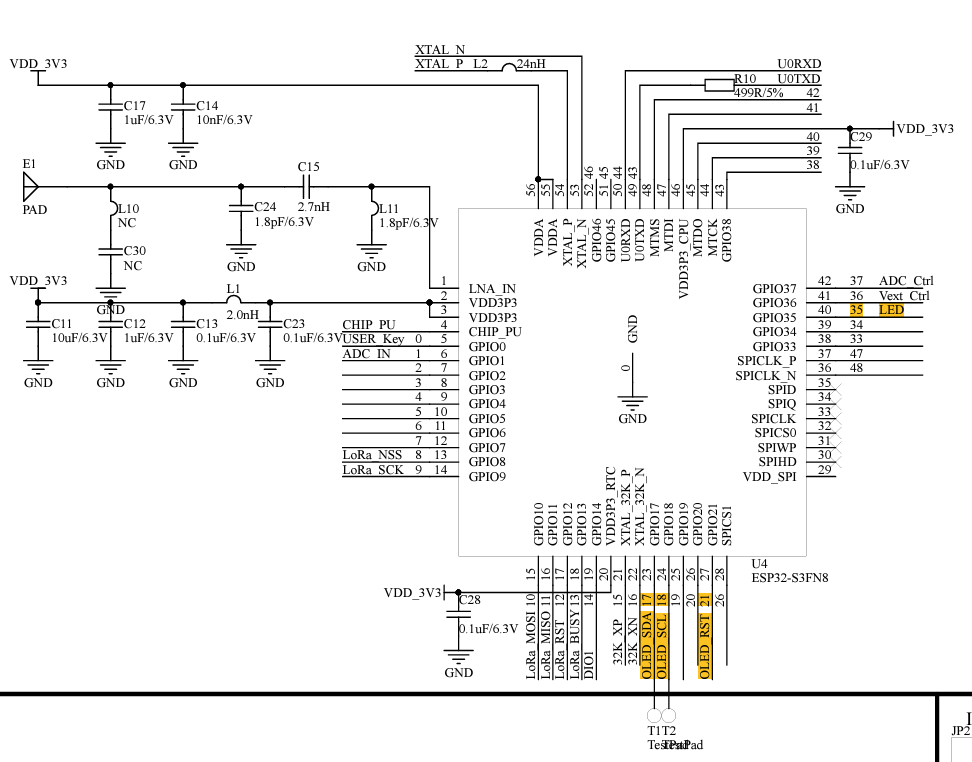

# Pinout for Heltec Wifi Kit 32 V3


* **White LED** Pin 35.
* **OLED SDA** Pin 17.
* **OLED SCL** Pin 18.
* **OLED RST** Pin 21.

# Setting up MicroPython on Heltec WiFi Kit 32 V3

This guide will walk you through setting up MicroPython on your Heltec WiFi Kit 32 V3.

## Prerequisites

* **Heltec WiFi Kit 32 V3:** Your ESP32 development board.
* **Computer:**  With Windows, macOS, or Linux.
* **USB Cable:** A micro-USB cable.
* **MicroPython Firmware:** Download the latest stable version from [micropython.org/download](micropython.org/download). I am using https://micropython.org/download/ESP32_GENERIC_S3/ latest firmware (v1.24.1 (2024-11-29).bin)
* **Mu IDE** I am testing on Mu IDE but feel free to choose your own.

## Installation Steps

### 1. Install ESPTool on your comptuer

Use pip to install the ESPTool:

```bash
pip install esptool # allows flashing of the esp firmware
pip install adafruit-ampy # allows transfer of data from computer to board

esptool.py --chip esp32 --port /dev/ttyUSB0 erase_flash
esptool.py --chip esp32 --port /dev/ttyUSB0 write_flash -z 0x1000 micropython-esp32-xxxx.bin

```

### Transferring libraries to the ESP32
To run the OLED on the ESP32, we need the driver/library `ssd1306.py`. 
https://github.com/adafruit/micropython-adafruit-ssd1306
#### Transferring 
```ampy --port COM12 --baud 115200 put x:\location\ssd1306.py```

Reference: (https://www.instructables.com/MicroPython-on-an-ESP32-Board-With-Integrated-SSD1/)


# Sample code with Micropython

### Blinking the LED
The following code blinks the white LED.

``` python
from machine import Pin
import time

led = Pin(35, Pin.OUT)  # The onboard white led on pin 35

while True:
    led.on()
    time.sleep(0.5)
    led.off()
    time.sleep(0.5)
```

Testing the OLED Display 
``` python
from machine import I2C, Pin
import ssd1306

rst = Pin(21, Pin.OUT)
rst.value(1)
scl = Pin(18, Pin.OUT, Pin.PULL_UP)
sda = Pin(17, Pin.OUT, Pin.PULL_UP)
i2c = I2C(scl=scl, sda=sda, freq=450000) # freq is the refresh rate
oled = ssd1306.SSD1306_I2C(128, 64, i2c, addr=0x3c)
oled.fill(0)
oled.text('ESP32', 45, 5)
oled.text('TestCode', 20, 20)
oled.show()
```

Saving the code permanently on the ESP32: `main.py`

Note: you will needto call the function into `boot.py` for further saving.
``` python
# main.py

def write_code_to_file():
    """Writes the provided MicroPython code to a file named 'main.py'."""

    code = """
from machine import I2C, Pin
import ssd1306

rst = Pin(21, Pin.OUT)
rst.value(1)
scl = Pin(18, Pin.OUT, Pin.PULL_UP)
sda = Pin(17, Pin.OUT, Pin.PULL_UP)
i2c = I2C(scl=scl, sda=sda, freq=400000)
oled = ssd1306.SSD1306_I2C(128, 64, i2c)
oled.fill(0)
oled.text('ESP32', 45, 5)
oled.text('TestCode', 30, 20)
oled.show()
    """

    try:
        with open('main.py', 'w') as file:
            file.write(code)
        print("Code written to 'main.py' successfully!")
    except Exception as e:
        print(f"Error writing to file: {e}")

# Call the function to write the code
write_code_to_file()# Write your code here :-)
```
